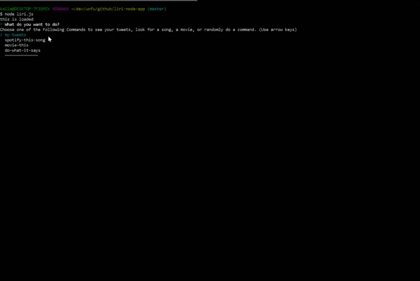

# liri-node-app

This assignment is made using Node.js utilizing the command line to run and make requests to different api's depending on what how the prompts answered in the command line.

**Start**: To begin the app, open the command line and enter `node liri.js`

__API's used:__ Twitter Api, Spotify Api, and OMDBapi.

There is a total of 4 command options available.

* `my-tweets` This command will return the users last 20 tweets.

__Example(s)__

* `spotify-this-song` This command and its additional prompt will search spotify for a track.
    **Results of Command:**

       * Artist(s)    
       * The song's name     
       * A preview link of the song from Spotify
       * The album that the song is from

* `movie-this` This command and its additional prompt will search OMDB for a movie.

    **Results of Command:**

       * Title of the movie.
       * Year the movie came out.
       * IMDB Rating of the movie.
       * Rotten Tomatoes Rating of the movie.
       * Country where the movie was produced.
       * Language of the movie.
       * Plot of the movie.
       * Actors in the movie.

* `do-what-it-says`: This command will run whatever command and additional parameters are found in `random.txt`. Must be in proper format of <spotify-this-song,"I Want it That Way">.

The app will prompt you to make a choice of the above mentioned choices. Once a choice is made the user will then be prompted to input a string to be searched, only the `spotify-this-song` and `movie-this` commands will prompt the additional string. The results will be logged in the Command line.

All the commands, arguments, and results, that are accepted, will be appended to `log.txt` to see what was done.

**Notice:** Current design using the `*random.txt` to supply the command and additional parameter to the `do-what-it-says` command can only at this time support one command and parameter.

**Future Development:** Add the ability to add more commands and parameters for the `do-what-it-says`command to choose from at random.
